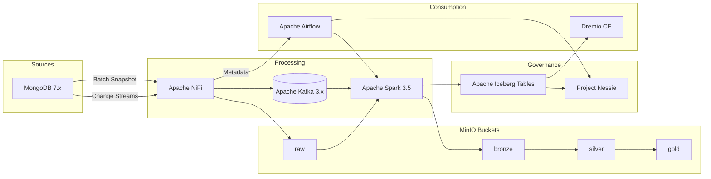

# Architecture

## Overview

This lakehouse architecture combines open-source components to deliver a modern data platform with governed batch and streaming ingestion, schema evolution, and interactive analytics.

## Data flow

1. **Batch snapshots**: NiFi queries MongoDB collections with incremental pagination and lands raw JSON into MinIO `raw/` partitions (one folder per date). Airflow triggers the Spark batch job to normalize nested structures, preserving unknown fields in `_rest` maps, and writes Iceberg tables in the `bronze` bucket. Subsequent transforms (silver/gold) run via Spark or Dremio reflections.

2. **Streaming CDC**: MongoDB change streams feed NiFi. Depending on the deployment flag `ENABLE_KAFKA`, NiFi publishes change events to Kafka topics (`mongo.cdc.<collection>`) or directly to Spark structured streaming via Site-to-Site. The Spark streaming job consumes from Kafka, parses CRUD events, performs `MERGE INTO` Iceberg tables, and handles tombstones.

3. **Catalog & governance**: Project Nessie maintains multi-branch table metadata for Iceberg, backed by PostgreSQL. Each Spark job writes to a Nessie branch (`main` by default). Airflow DAGs manage branching, tagging, and retention policies based on `config/iceberg/retention_policies.yml`.

4. **Analytics**: Dremio connects both to the MinIO S3 buckets and to Nessie-managed Iceberg tables. Bootstrap JSON scripts create sources and reflections. Reflections accelerate curated queries (e.g., aggregations on `payments.orders`). Time-travel queries leverage Iceberg snapshot IDs stored in Nessie. This enables analysts to perform **time travel** investigations across historical states.
   Example: `SELECT * FROM payments.merchant_events FOR TIMESTAMP AS OF TIMESTAMP '2024-03-01 00:00:00'` restores a previous view of merchant activity.

## Schema evolution

Spark ingestion retains nested structures using automatic flattening while storing unrecognized attributes in a `_rest` map column. When business teams promote new fields, the `schema_evolution_demo.py` job executes `ALTER TABLE` commands to add top-level columns while keeping historical data accessible. Row-level updates maintain compatibility thanks to Iceberg's schema versioning.

## Partitioning strategy

* Default partition transform: `days(event_ts)` ensures efficient pruning for common queries.
* CDC tables add `bucket(16, merchant_id)` to distribute small updates evenly.
* Metadata tables follow Iceberg defaults and store snapshots in the `iceberg-metadata` bucket.

## Optional components

* **Kafka** is optional but recommended for CDC fan-out to additional consumers. When disabled, Spark reads directly from Mongo via the Mongo Spark connector.
* **Traefik / Ingress**: TLS termination is out-of-scope for local deployments but documented in [operations.md](operations.md).

## Configuration management

The repository centralizes settings:

* Environment variables in `env/*.env`
* Iceberg catalog properties in `config/iceberg/catalog.properties`
* Table defaults in `config/iceberg/table_properties.yml`
* NiFi controller services in `config/nifi/controller_services.json`
* Dremio sources in `config/dremio/sources.json`

